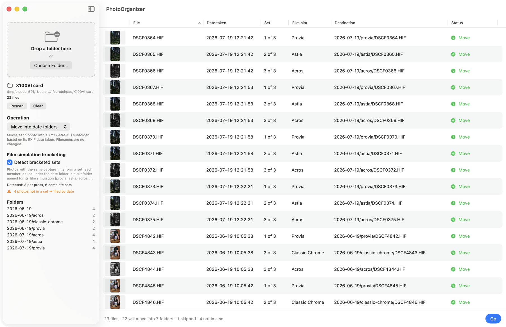

# PhotoOrganizer

A small, careful macOS app that turns the flat pile of photos you copy off a camera card into
dated folders — and, for Fujifilm shooters, files **film simulation bracketed** shots into
per‑simulation subfolders. It shows you exactly what it is going to do first: nothing on disk
changes until you press **Go**.

<picture>
  <source media="(prefers-color-scheme: dark)" srcset="docs/screenshots/main-dark.png">
  
</picture>

*A card copy from a Fujifilm X100VI. Each shutter press wrote three files (one per film
simulation); they are recognised as a set and filed into `provia/`, `astia/` and `acros/` under
the day's folder. The four single JPGs go straight into their date folder.*

## Why

Image Capture — like most card readers — dumps everything into one folder. I wanted a tool that

- files by the **date the photo was taken** (from EXIF), not the date it was copied;
- understands the X100VI's **film simulation bracketing**, where every press writes three files
  with three different looks, so each look ends up in its own folder;
- **never surprises me**: a complete preview before anything moves, thumbnails to check the set
  grouping by eye, and no overwrites, ever.

## What it does

- **Drop a folder, review, Go.** Drag a folder onto the sidebar (or *Choose Folder…*). The table
  lists every file with its date, destination and status. Press **Go** when you're happy; a report
  tells you what moved and what (if anything) failed.
- **Date folders.** `2026-07-19/DSCF0364.HIF`, named from the photo's EXIF `DateTimeOriginal`.
  Filenames are never changed.
- **Bracketed sets.** Turn on *Detect bracketed sets* and members of a set go one level deeper:
  `2026-07-19/provia/`, `2026-07-19/astia/`, `2026-07-19/acros/`… The number of photos per press
  is detected from the files themselves — there is nothing to configure.
- **Thumbnails.** Every row has one; click it for a sharp 512 px preview with the file's date, film
  simulation, set position and destination.
- **Safe to re-run.** Run it again on the same folder and nothing happens: files already in date
  folders are never touched, and an existing file is never overwritten.

### Example

```
X100VI card/                                 X100VI card/
├── DSCF0364.HIF   12:21:42  Provia          ├── 2026-06-19/
├── DSCF0365.HIF   12:21:42  Astia           │   ├── DSCF4860.JPG … DSCF4863.JPG   (single shots)
├── DSCF0366.HIF   12:21:42  Acros           │   ├── acros/           DSCF4844.HIF  DSCF4847.HIF
├── DSCF0367.HIF   12:21:53  Provia          │   ├── classic-chrome/  DSCF4843.HIF  DSCF4846.HIF
├── …                                        │   └── provia/          DSCF4842.HIF  DSCF4845.HIF
├── DSCF4842.HIF   10:05:38  Provia    ──▶   ├── 2026-07-19/
├── DSCF4843.HIF   10:05:38  Classic Chrome  │   ├── acros/           DSCF0366.HIF  DSCF0369.HIF  …
├── DSCF4844.HIF   10:05:38  Acros           │   ├── astia/           DSCF0365.HIF  DSCF0368.HIF  …
├── …                                        │   └── provia/          DSCF0364.HIF  DSCF0367.HIF  …
├── DSCF4860.JPG                             └── notes.txt                          (not an image)
└── notes.txt
```

## Workflow

1. Copy the card to a folder on your Mac (Image Capture, Finder, whatever you use). The app warns
   if you point it at a removable volume or a `DCIM` folder — organise the copy, not the card.
2. Open PhotoOrganizer and drop the folder onto the sidebar.
3. Check the preview. The **Status** column says what will happen to each file and why (hover for
   details); the sidebar lists the folders that will be created and how many files land in each.
4. Press **Go**. Only rows marked *Move* are touched.

## Filing rules

### Move into date folders

Each image is moved into a `YYYY-MM-DD/` subfolder of the chosen folder, named from its EXIF
**DateTimeOriginal** (falling back to `DateTimeDigitized`, then the TIFF `DateTime`).

Deliberately conservative:

- **Camera-local date.** The date is taken verbatim from the EXIF string and never converted
  through a time zone, so a 23:30 shot stays on the day the camera says it was taken.
- **Never overwrite.** If `YYYY-MM-DD/<name>` already exists the file is skipped and left where it
  is — checked when planning and again immediately before each move.
- **No EXIF date → skipped.** There is no silent fallback to file-system dates (copying alters those).
- **Top level only.** Subfolders are not scanned, so files that are already organised are never
  touched and running the app twice is harmless.
- **Any image ImageIO can read** is handled: JPG, HIF/HEIF/HEIC, RAF, DNG, TIFF, PNG… Other files
  (`.MOV`, `.XMP`, text…) are listed as *Not an image* and left alone. Hidden files, symlinks,
  aliases and packages are ignored.

### Film simulation bracketing

Fujifilm's *film simulation bracketing* writes several files per shutter press, one per film
simulation. With **Detect bracketed sets** on, each member of a set is filed into a subfolder of
the date folder named for its simulation: `2026-07-15/provia/`, `2026-07-15/astia/`,
`2026-07-15/acros/`… Photos that aren't part of a set stay directly in `2026-07-15/`.

How sets are found:

- Files of one press share their EXIF date-time **and** sub-second timestamp (and file type).
  Walking the files in filename order, runs with identical values are the candidate sets.
- The most common run length on the card is the detected **photos per press**; the sidebar shows
  it (e.g. *Detected: 3 per press, 881 complete sets*).
- Only runs of exactly that length become sets. Everything else — single shots, a press with a
  deleted frame, an odd-sized run — is filed directly into `YYYY-MM-DD/` and marked **none** in the
  *Set* column, so nothing is silently mis-filed.
- Folder names come from the film simulation the camera recorded: `provia`, `velvia`, `astia`,
  `classic-chrome`, `classic-neg`, `nostalgic-neg`, `reala-ace`, `eterna`, `bleach-bypass`,
  `pro-neg-std`, `pro-neg-hi`, `acros` (and `acros-r` / `-ye` / `-g`), `monochrome`, `sepia`. If a
  member's simulation can't be read, or two members would share a name, that member falls back to
  its position in the set (`set2/`). For those fallback folders the sidebar shows the dominant
  simulation and says *mixed* if several would land there.
- Organised folders are never nested again. Dropping a date folder (`…/2026-07-15`) with detection
  on splits that day's photos into simulation subfolders; photos already inside one
  (`…/2026-07-15/acros`) are reported as *Already in place*.

Limitations: detection relies on sub-second timestamps, so a camera that doesn't write them may
confuse bursts with sets (the preview will show it); and a filename rollover (`DSCF9999` →
`DSCF0001`) inside one press splits that press into unassigned singles.

## Requirements

- macOS 15 Sequoia or later.
- Xcode 26 or later to build (Swift 6 language mode with strict concurrency; uses `@concurrent`).
  There is no prebuilt download yet.

## Building and running

Open `PhotoOrganizer.xcodeproj` in Xcode and press Run, or from the terminal:

```sh
export DEVELOPER_DIR=/Applications/Xcode.app/Contents/Developer
xcodebuild -project PhotoOrganizer.xcodeproj -scheme PhotoOrganizer -configuration Debug -derivedDataPath build build
open build/Build/Products/Debug/PhotoOrganizer.app
```

Handy launch arguments (also usable from the scheme's *Arguments* tab):

```sh
open build/Build/Products/Debug/PhotoOrganizer.app --args -folder ~/Pictures/card -bracketing.enabled YES
```

### Tests

```sh
xcodebuild -project PhotoOrganizer.xcodeproj -scheme PhotoOrganizer -destination 'platform=macOS' -derivedDataPath build test
```

The suite uses Swift Testing. Fixtures are tiny JPEG/HEIC files generated on the fly with
`CGImageDestination` (with `DateTimeOriginal`, sub-second and orientation tags), so the repository
contains no photos and the tests never touch anything outside a temporary directory.

## How it's built

The app is a straight pipeline; everything before the last step is pure and side-effect free:

```
FolderScanner ──▶ ImageMetadataReader ──▶ BracketSetAssigner ──▶ MoveIntoDateFoldersOperation ──▶ PreviewPane ──▶ ChangeExecutor
 list top level    ImageIO, one pass        runs of equal          plan: [PlannedChange]           table + Go       the only code
 skip hidden/…     date · subsec · sim      capture times          (pure, re-run on toggle)                         that writes
```

| Path | What lives there |
|---|---|
| `PhotoOrganizer/Core/` | Pure logic: `ExifDate`, `ImageMetadata` (+ Fujifilm film-simulation table), `ImageMetadataReader`, `FolderScanner`, `BracketSetAssigner`, `OrganizeOperation` / `MoveIntoDateFoldersOperation`, `PlannedChange`, `ThumbnailLoader`, `ChangeExecutor` |
| `PhotoOrganizer/Model/` | `OrganizerModel` — the `@Observable` state machine behind the window — and `ThumbnailCache` |
| `PhotoOrganizer/Views/` | SwiftUI: `NavigationSplitView` with the sidebar (drop zone, operation, bracketing toggle, folder read-out) and the preview table |
| `PhotoOrganizerTests/` | Swift Testing suites and the fixture generator |
| `docs/screenshots/` | The images in this README |

Design notes:

- **Metadata without decoding.** `ImageMetadataReader` makes one ImageIO pass per file with
  caching off (a few milliseconds per 40 MP HEIF). The film simulation comes from ImageIO's
  `{PictureStyle}` dictionary, whose codes match ExifTool's Fujifilm `FilmMode` / `Saturation`
  tables. Table thumbnails use the thumbnail embedded in the file, fetched untransformed (ImageIO
  mangles rotated HEIF thumbnails), with the letterbox bars Fujifilm bakes into JPEG thumbnails
  trimmed (`ThumbnailLetterbox`) and the EXIF orientation applied in-app; the 512 px preview
  decodes the image on demand and is cached.
- **Planning is pure.** `plan(files:in:options:)` returns a `PlanResult` and never touches disk, so
  toggling bracket detection re-plans instantly from metadata already in memory, and the same code
  is exercised by tests without fixtures on disk.
- **One writer.** `ChangeExecutor` is the only type that modifies the file system. It creates the
  destination folders, re-checks source and destination immediately before each `moveItem`, and
  carries on after an error so one bad file doesn't abort the run.
- **Swift 6 concurrency.** The model is `@MainActor @Observable`; scanning, executing and thumbnail
  loading are `@concurrent` functions that report progress back to the main actor.

### Adding an operation

Write a type conforming to `OrganizeOperation` — `plan(files:in:options:)` must be pure — and add it
to `OrganizeOperations.all`. The picker, preview table and executor need no changes;
`OrganizeOptions` carries the user-selectable settings (currently just bracket-set detection).

## Safety and privacy

- The app only ever **moves** files, and only within the folder you chose. It never deletes,
  renames or overwrites anything.
- Nothing happens until you press **Go**, and only rows marked *Move* are touched.
- No network access, no analytics, no background activity.
- It runs without the App Sandbox (hardened runtime on) because it needs plain access to whatever
  folder you drop. To sandbox it later, enable `ENABLE_APP_SANDBOX` with user-selected read/write
  and add security-scoped bookmark handling in `OrganizerModel.setFolder` — the only place folder
  access is established.

## Ideas

- **Undo last run** — the executor already returns the exact list of moves it made.
- More operations: RAW + JPEG pairing, renaming by capture time, flattening a day back out.
- A notarised release build.

## License

[MIT](LICENSE)
